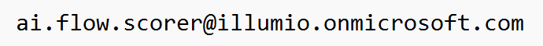

# 🤖 AI-FlowScorer

> ⚠️ **BETA SOFTWARE — PROVIDED AS IS**
> This project is experimental and provided **without guarantees**, **without support**, and **without any SLA**.

**AI-FlowScorer** is a browser extension that augments the Traffic page with real-time AI-driven traffic scoring.

Each observed traffic flow is analyzed by **AI-FlowScorer**, which evaluates flow metadata and returns a **confidence score** to **assist with traffic review and policy writing**.
Scores and explanations are rendered inline to **support human judgment and prioritization**; final policy decisions remain the responsibility of the reviewer.

---

## ✨ Features

* Automatic extraction of flow metadata from Traffic page
* AI-based scoring using **Gemma**
* Asynchronous scoring with retry and exponential backoff
* Inline score badges rendered in the Policy Decision column
* Clear, color-coded confidence indicators
* Concurrent request throttling for large datasets
* Mutation-safe rendering for dynamically loaded rows
* Floating enable/disable toggle (Shadow DOM isolated)
* Persistent enable state via `localStorage`

---

## 🧠 Scorer — Gemma

The scoring engine evaluates **flow-level metadata only**.
It does **not** inspect application payloads or packet contents.

### Model

* **Gemma**

### Inputs

The scorer receives structured flow metadata, including:

* Source and destination labels, lists, and object names
* Ports
* Protocol

### Outputs

For each flow, the scorer returns:

* **Confidence score**
* **Reason** explaining the scoring decision

The confidence score represents the model’s assessment of **observed traffic characteristics**, intended to **assist with traffic review and policy writing**.

---

## 🎨 Score Badge Logic

| Score | Indicator | Meaning                      |
| ----: | --------- | ---------------------------- |
|  ≥ 60 | ✅ Green   | High confidence / lower risk |
| 30–59 | ⚠️ Amber  | Medium confidence            |
|  < 30 | ❗ Red     | Low confidence / higher risk |
| Error | ⚠️ ERR    | Scoring failed               |

Hovering over a badge displays the **reason** returned by the scorer.

---

## 🖥️ Supported Pages

The extension activates **only** on pages whose URL path matches supported Traffic views.

If the page does not match, the script exits without performing any actions.

---

## 📊 How It Works

1. Waits for the traffic flow grid to load
2. Extracts flow metadata from each grid row
3. Queues flows for scoring with concurrency limits
4. Sends scoring requests:

   * Via extension runtime messaging (if available)
   * Falls back to direct HTTPS POST
5. Receives confidence score and reason from Gemma
6. Renders a color-coded badge inline
7. Re-applies scores when rows are dynamically added or re-rendered

---

## 🧩 UI Toggle

A floating **checkbox toggle** appears in the bottom-right corner of the page:

* Isolated using **Shadow DOM**
* Automatically re-injected if removed by the page
* Persists enabled/disabled state across reloads

Checking the checkbox enables AI-FlowScorer.  
By checking the checkbox, the user acknowledges the model terms linked in the UI.

---

## 🔐 Security, Network & Access Controls

### Frontend

* HTTPS/TLS enforced
* CA-signed certificates
* Strong cipher suites only

### AI Model Endpoint

* The AI scoring endpoint is **private and not publicly accessible**
* Hosted on **private, internally controlled infrastructure**
* Protected by a **firewall in front of the model service**
* **Inbound access is allow-listed only**
* Requests from non-approved source IPs are blocked
* Flow metadata is sent **only to this internal endpoint**
* **No data is transmitted to third-party AI services**

#### Access Requests

To request allow-listing for the AI scoring endpoint, contact the team using the email address shown below:



Please include:

* **Source IP address(es)** to be allow-listed
* A brief description of intended use

> Submission of an allow-list request does **not** imply approval, support, or SLA.

### Backend

* Locked-down, immutable cloud instance
* **No SSH access**
* **No key-based logins**

### Data & Logging

* No application or payload inspection
* No raw application or payload logs persisted
* Only flow metadata required for scoring is transmitted
* Strict firewall and network controls permit only required endpoints

### Model Compliance

* Use of **Gemma** follows their respective licensing and acceptable-use terms

---

## 📜 Model Terms

By enabling and using AI-FlowScorer, you agree to the Gemma model terms:

👉 [https://ai.google.dev/gemma/terms](https://ai.google.dev/gemma/terms)

---

## 🛠️ Installation

### Firefox (Install Add-on From File)

1. Clone or download this repository.
2. Open **Firefox** and navigate to:

   ```
   about:addons
   ```
3. Click the **⚙️ (gear icon)** in the top-right corner.
4. Select **Install Add-on From File…**
5. Navigate to the `firefox/` directory in this repository and select the **`.xpi` file**.
6. Confirm the installation when prompted.
7. Navigate to the **Traffic** page, refresh the page, and enable **AI-FlowScorer** by checking the on-page checkbox.

---

### Chromium-Based Browsers (Chrome, Edge, Brave)

1. Clone or download this repository.
2. Open the browser extensions page:

   * Chrome: `chrome://extensions`
   * Edge: `edge://extensions`
   * Brave: `brave://extensions`
3. Enable **Developer mode** (top-right corner).
4. Click **Load unpacked**.
5. Select the **chromium extension directory** in this repository containing:

   * `ai-flow-scorer.js`
   * `background.js`
   * `manifest.json`
6. Verify the extension is loaded and enabled.
7. Navigate to the **Traffic** page, refresh the page, and enable **AI-FlowScorer** by checking the on-page checkbox.

---

### Verification

After installation:

* Open the **Traffic** page
* Confirm the **AI-FlowScorer checkbox** appears in the bottom-right corner
* Begin scoring by **checking the checkbox**

---

## 🧪 Debugging

Open browser DevTools and filter logs by:

```
🤖 AI-FlowScorer:
```

Logs include:

* Extracted flow payloads
* Scoring attempts and retries
* Backend responses
* UI injection status

---

## 🚧 Limitations & Disclaimer

* **BETA SOFTWARE** — behavior may change without notice
* No guarantees of accuracy, availability, or fitness for any purpose
* No support is provided
* UI selectors depend on Traffic DOM structure
* Backend availability is not guaranteed
* Access to the AI model endpoint requires explicit allow-listing

---

## 📄 License

Licensed under the **Apache License, Version 2.0**.

This software is provided **“AS IS”**, without warranties or conditions of any kind, either express or implied.
See the `LICENSE` file for full details.
